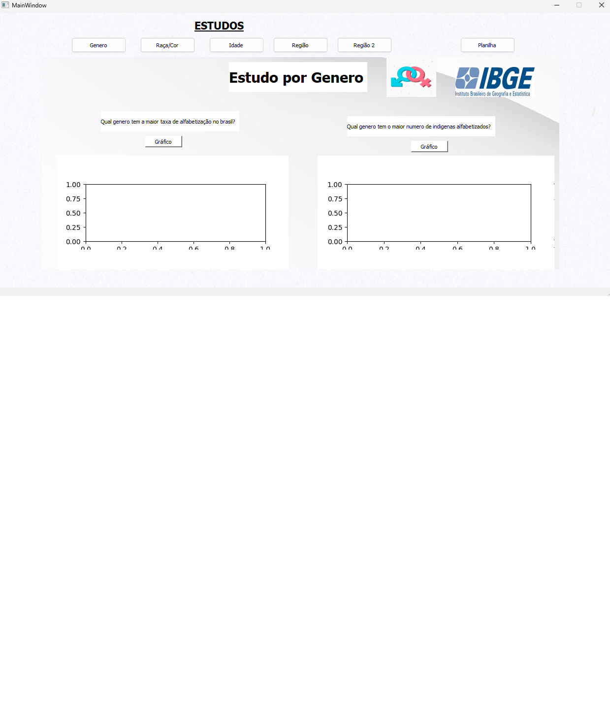
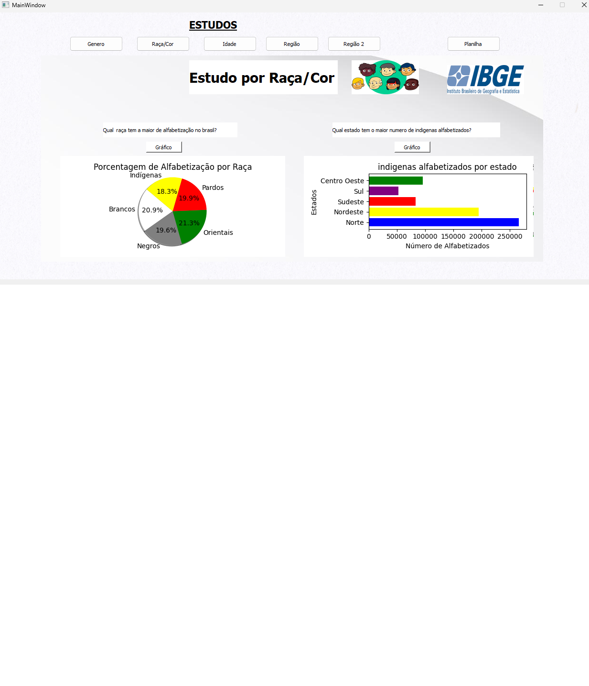

# Python Qt Data Dashboard

Aplicativo desktop desenvolvido em Python com interface gráfica em PyQt5/Qt Designer para automação, tratamento e visualização de dados.

## Funcionalidades
- Download automático de planilhas com Selenium
- Tratamento e organização dos dados com pandas
- Geração de gráficos com matplotlib
- Exibição dos resultados em interface desktop

## Tecnologias utilizadas
- Python
- PyQt5
- Qt Designer
- Selenium
- pandas
- matplotlib
- openpyxl

## Como executar

1. Clone este repositório  
2. Instale as dependências:

```bash
pip install -r requirements.txt
```
---

## Interface do aplicativo

### Tela principal


### Visualização de gráficos


### Planilha

